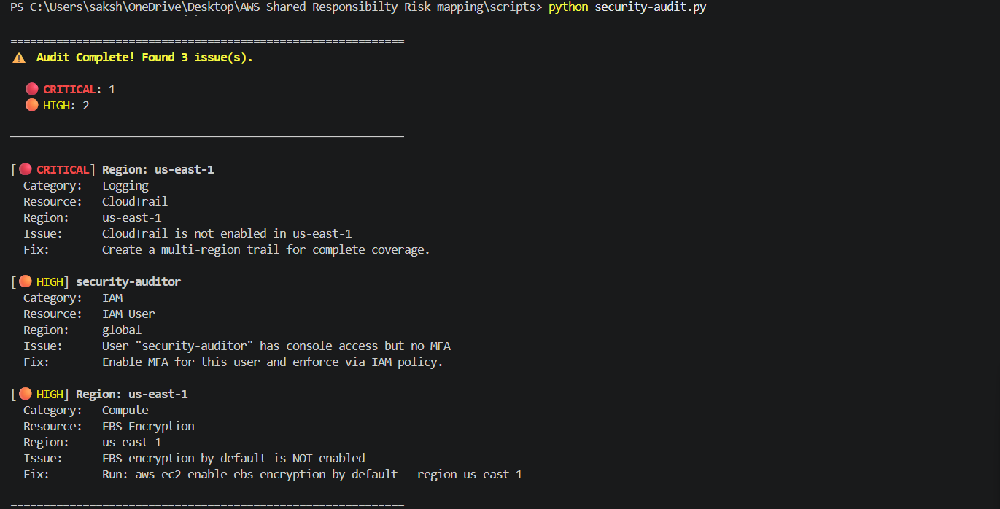
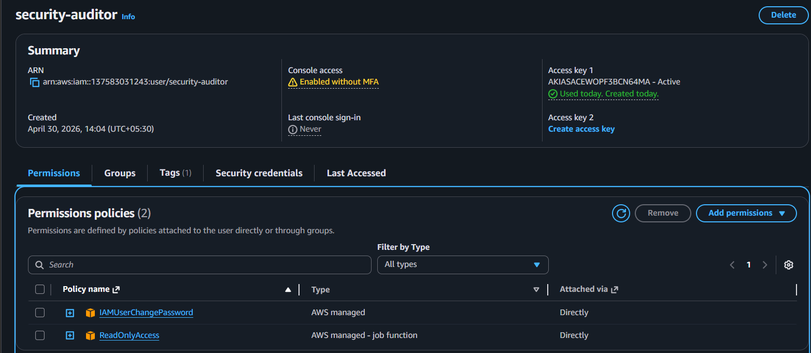
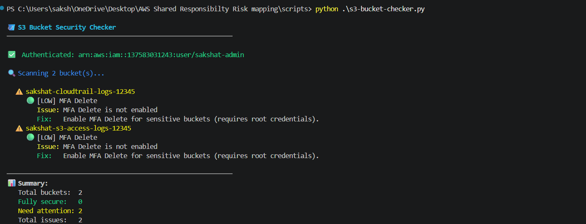
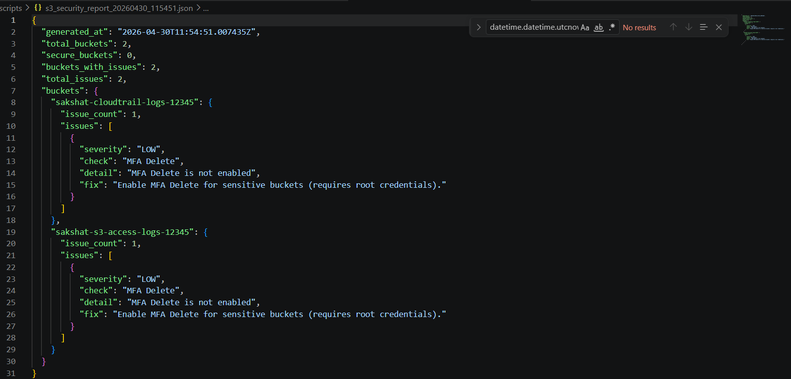
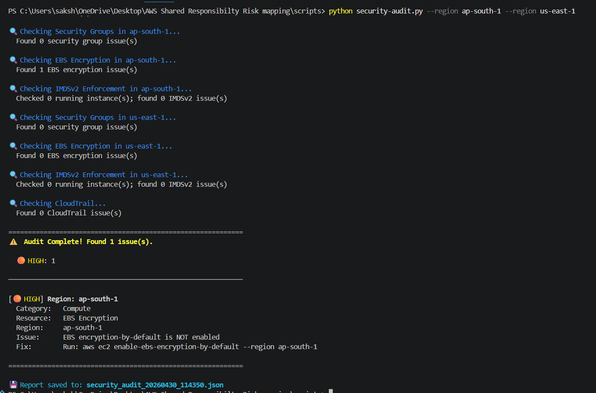
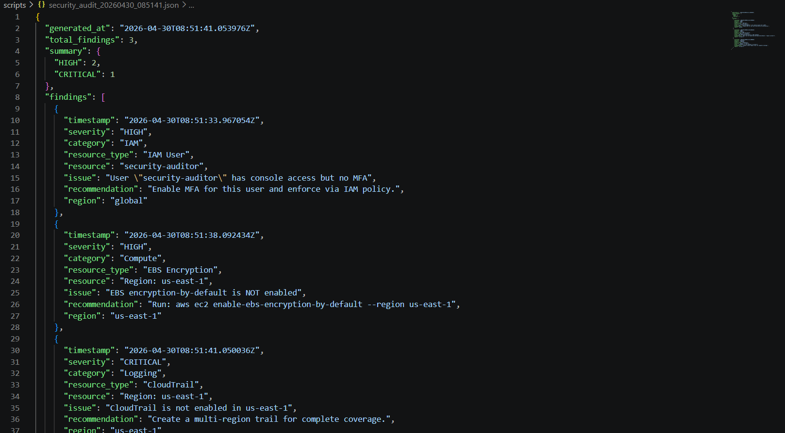
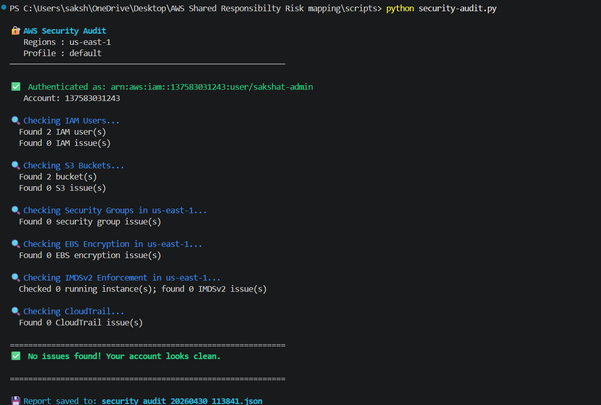

# 🔐 AWS Shared Responsibility Risk Mapping


> A comprehensive AWS cloud security framework implementing the AWS Shared
> Responsibility Model to identify, analyze, and mitigate security risks across
> IAM, networking, storage, compute, and logging.

---

## 📌 Project Overview

This project simulates a real-world AWS security audit by:

- Scanning IAM, S3, EC2, EBS, and CloudTrail configurations
- Detecting misconfigurations and security risks
- Generating structured JSON reports
- Applying fixes and validating a secure environment

This project is a practical AWS security project that detects, fixes, and validates real-world cloud misconfigurations using automated auditing and security best practices.

---

## ⚙️ Tech Stack

- Python (boto3)
- AWS CLI
- IAM, S3, EC2, EBS, CloudTrail
- Terraform (for infrastructure baseline - optional)
- JSON reporting

---
## 🚀 Features

- 🔐 IAM Security Checks (MFA, access risks)
- 🪣 S3 Bucket Security Analysis
- 🌍 Multi-region Risk Detection
- 💾 EBS Encryption Validation
- 📊 JSON-based Audit Reports
- ⚡ CLI-based automation

---
### Target Audience

- ☁️ Cloud security beginners
- 🔧 DevSecOps engineers
- 🎓 Mentors guiding interns
- 📖 Anyone learning AWS security fundamentals
---

## Repository Structure

```
aws-shared-responsibility-risk-mapping/
├── README.md                          # Project overview and guide
├── LICENSE                            # MIT License
├── requirements.txt                   # Python dependencies
├── .github/
│   └── ISSUE_TEMPLATE/
│       ├── bug_report.md              # Bug report template
│       └── feature_request.md        # Feature request template
├── docs/
│   ├── shared-responsibility-model.md # AWS Shared Responsibility deep dive
│   ├── risk-categories.md            # Risk categories and severity
│   └── mitigation-strategies.md     # Best practices and mitigations
├── risk-assessment/
│   ├── risk-assessment-template.md   # Template for running risk reviews
│   └── checklist.md                  # AWS security checklist
├── scripts/
│   ├── security-audit.py             # Main AWS security audit script
│   └── s3-bucket-checker.py          # S3 bucket security assessment
├── screenshots/
│   ├── 01-before-audit-critical.png
│   ├── 02-iam-user-no-mfa.png
│   ├── 03-s3-checker-output.png
│   ├── 04-s3-json-report.png
│   ├── 05-ebs-encryption-multi-region.png
│   ├── 06-audit-json-report.png
│   └── 07-after-audit-clean.png
└── templates/
    └── secure-ec2-terraform/
        ├── main.tf                   # Terraform config
        ├── variables.tf              # Input variables
        └── outputs.tf                # Terraform outputs
        
```

---


## 🔴 Step 1: Initial Security Audit (Issues Found)

<p align="center">
  
</p>
<p align="center">
  <em>Before Audit</em>
</p>

The audit identified:

- CloudTrail not enabled (CRITICAL)
- IAM user without MFA
- EBS encryption not enabled

---

## 🔐 Step 2: IAM Misconfiguration (No MFA)
<p align="center">
  
</p>
<p align="center">
  <em>IAM Misconfiguration</em>
</p>


### Risk:
- Console access without MFA
- High risk of account takeover

### Fix:
- Enabled MFA
- Enforced IAM policy

---

## 🪣 Step 3: S3 Bucket Security Check
<p align="center">
  
</p>
<p align="center">
  <em>S3 Checker</em>
</p>

### Issues:
- MFA Delete not enabled

---

## 📊 Step 4: S3 JSON Report
<p align="center">
  
</p>
<p align="center">
  <em>S3 Report</em>
</p>

### Feature:
- Structured bucket-level findings
- Automated reporting

---

## 🌍 Step 5: Multi-Region Risk Detection
<p align="center">
  
</p>
<p align="center">
  <em>EBS Issue</em>
</p>

### Insight:
- EBS encryption was disabled in ap-south-1
- Security posture varies across regions

### Fix:
```bash
aws ec2 enable-ebs-encryption-by-default --region ap-south-1
```

---

## 📄 Step 6: Full Audit JSON Report
<p align="center">
  
</p>
<p align="center">
  <em>Audit Report</em>
</p>

### Includes:
- Severity levels (CRITICAL / HIGH / MEDIUM)
- Resource details
- Fix recommendations

---

## ✅ Step 7: Final Secure State
<p align="center">
  
</p>
<p align="center">
  <em>After Audit</em>
</p>

✔ All issues resolved  
✔ Secure AWS configuration achieved  
✔ Validation through re-audit  

---

## 🏗️ Terraform Infrastructure (Optional)

Terraform configurations are included to provision a secure IAM monitoring baseline using AWS services such as:

- CloudTrail
- AWS Config
- CloudWatch

These configurations demonstrate **infrastructure-level security automation** and can be used to set up continuous monitoring for IAM activities.

⚠️ **Note:** Terraform is not executed by default. Infrastructure deployment is optional and should be reviewed using `terraform plan` before applying, as it may create AWS resources that incur costs.

---

## 🧠 Key Learnings

- Importance of MFA in IAM security
- S3 bucket hardening techniques
- CloudTrail for logging and monitoring
- Multi-region security considerations
- Automating cloud audits using Python
- Infrastructure security using Terraform

---

## Setup and Prerequisites

### 1. AWS Account & Free Tier

You need an AWS account. New accounts receive:
- ~$200 in credits
- 12-month Free Tier (750 hours/month of t2.micro Linux)

> ⚠️ **Use Free Tier resources wherever possible during development.**

### 2. Local Environment

**Python 3.8+ required:**

```bash
# Check Python version
python3 --version

# Clone the repository
git clone https://github.com/swasthikunder/aws-shared-responsibility-risk-mapping.git
cd aws-shared-responsibility-risk-mapping

# Create and activate virtual environment (recommended)
python3 -m venv .venv
source .venv/bin/activate        # Linux/macOS
# .venv\Scripts\activate         # Windows

# Install required packages
pip install -r requirements.txt
```
> Note- ⚠️ Replace `<your-bucket-name>` and `<your-account-id>` before using these policies.


### 3. AWS CLI Configuration

```bash
aws configure
# Enter:
#   AWS Access Key ID:     <your-key>
#   AWS Secret Access Key: <your-secret>
#   Default region:        us-east-1
#   Output format:         json
```

### 4. Terraform Installation

**macOS (Homebrew):**
```bash
brew tap hashicorp/tap
brew install hashicorp/tap/terraform
```

**Linux (APT):**
```bash
sudo apt-get update && sudo apt-get install -y gnupg software-properties-common
wget -O- https://apt.releases.hashicorp.com/gpg | gpg --dearmor | \
  sudo tee /usr/share/keyrings/hashicorp-archive-keyring.gpg
echo "deb [signed-by=/usr/share/keyrings/hashicorp-archive-keyring.gpg] \
  https://apt.releases.hashicorp.com $(lsb_release -cs) main" | \
  sudo tee /etc/apt/sources.list.d/hashicorp.list
sudo apt-get update && sudo apt-get install terraform
```

**Verify:**
```bash
terraform version
```

---

## Safe AWS Usage (Avoiding Costs)

> ⚠️ **WARNING:** Running `terraform apply` creates real AWS resources that can incur charges. Always destroy resources when finished testing.

| Resource | Potential Cost | Mitigation |
|----------|---------------|------------|
| NAT Gateway | ~$0.045/hr + $0.045/GB | Remove when not needed; use VPC Endpoints |
| EC2 Instances | Free Tier: 750 hrs/mo t2.micro | Use t2.micro; stop/terminate when idle |
| Data Transfer | ~$0.09/GB (Internet out) | Keep traffic within same AZ |
| EBS Volumes | Free: 30 GB SSD | Delete unattached volumes |
| CloudWatch Logs | ~$0.50/GB after free tier | Use short retention (7 days for testing) |

```bash
# Always preview before applying
terraform plan

# Destroy all resources when done
terraform destroy

# Preview destruction
terraform plan -destroy
```

---

## Usage: Scripts

### Script 1: `security-audit.py`

Audits your AWS account for common misconfigurations across Security Groups, S3 Buckets, IAM Users, and CloudTrail.

```bash
# Basic usage (uses default AWS profile and us-east-1)
python scripts/security-audit.py

# Specify region and profile
python scripts/security-audit.py --region us-west-2 --profile my-profile

# Scan multiple regions
python scripts/security-audit.py --region us-east-1 --region us-west-2
```

**Expected Output:**
```
🔍 Checking Security Groups in us-east-1...
🔍 Checking S3 Buckets...
🔍 Checking IAM Users...
🔍 Checking CloudTrail...
🔍 Checking EBS Encryption in us-east-1...
🔍 Checking IMDSv2 Enforcement in us-east-1...

⚠️  Audit Complete! Found 3 issues.

🔴 Critical: 1
🟠 High:     1
🟡 Medium:   1

[🟠 HIGH] sg-0abc12345 (my-web-sg)
  Category:  Networking
  Issue:     Security group allows 0.0.0.0/0 on port 22 (SSH)
  Fix:       Restrict SSH access to specific IP ranges or use AWS SSM Session Manager

Report saved to: security_audit_20260430_123456.json
```

### Script 2: `s3-bucket-checker.py`

Detailed S3 security scanner checking public access, encryption, versioning, logging, and HTTPS enforcement.

```bash
python scripts/s3-bucket-checker.py
```

**Expected Output:**
```
🔍 Scanning all S3 buckets...

⚠️  my-app-bucket
   ✗ Public access not fully blocked
   ✗ Default encryption not enabled

✅ my-secure-bucket (0 issues)

📊 Summary:
   Total buckets:  2
   Fully secure:   1
   Need attention: 1

💾 Detailed report saved to s3_security_report.json
```

---

## Usage: Terraform

```bash
cd templates/secure-ec2-terraform

# Initialize and download providers
terraform init

# Preview changes
terraform plan

# Apply changes (creates resources)
terraform apply

# IMPORTANT: Destroy when done to avoid charges
terraform destroy
```

**Resources Created:**
- ✅ VPC with public/private subnets and Internet Gateway
- ✅ Security Groups (ALB: HTTPS from 0.0.0.0/0; EC2: HTTP from ALB only)
- ✅ EC2 Instance (Amazon Linux 2, private subnet, IMDSv2 enforced)
- ✅ IAM Role (AmazonSSMManagedInstanceCore for Session Manager)
- ✅ Encrypted root EBS volume
- ✅ CloudWatch Log Groups (30-day retention)
- ✅ VPC Flow Logs
- ⚠️ NAT Gateway (optional — incurs cost, remove for free-tier testing)

---

## 🛡️ Security Best Practices Implemented

- Enforced HTTPS-only S3 access
- Enabled CloudTrail logging
- Enabled EBS encryption by default
- Enforced IAM MFA
- Structured audit reporting

---

## 📌 Future Improvements

- Add AWS Config integration
- Automated remediation scripts
- Dashboard for visualization
- CI/CD security checks

---

## 👥 Contributors

- Swasthi Kunder — Project Lead  
- Sakshat S — Contributor  

---

## License

This project is licensed under the MIT License — see the [LICENSE](LICENSE) file for details.

---